# Procesverslag
Markdown is een simpele manier om HTML te schrijven.  
Markdown cheat cheet: [Hulp bij het schrijven van Markdown](https://github.com/adam-p/markdown-here/wiki/Markdown-Cheatsheet).

Nb. De standaardstructuur en de spartaanse opmaak van de README.md zijn helemaal prima. Het gaat om de inhoud van je procesverslag. Besteedt de tijd voor pracht en praal aan je website.

Nb. Door *open* toe te voegen aan een *details* element kun je deze standaard open zetten. Fijn om dat steeds voor de relevante stuk(ken) te doen.

## Jij

### Ontwerper:
Aaron Smits

#### Je startniveau:
Mijn startniveau is: Rood

# Je plan

  
De eerste versie/schets van je ontwerp & je persoonlijke uitdaging

  Het concept waar ik nu eindelijk voor gekozen heb is het album concept, ik ga van de band gorillaz alle albums als een vinyl te presenteren. Via deze vinyls hoor je de muziek van de gorillaz en lees je over hoe erg hun stijl is veranderd bij dat album.

  De pagina begint op een kamer waar je alle albums te zien krijgt in een meubelstuk waar de vinyls in zitten. 
  De kamer heeft een duidelijke stijl en karakter. Hierdoor is het duidelijk voor de gebruiker wat de context is van deze pagina is en over welke band het gaat.

  ### De eerste schetsen:
  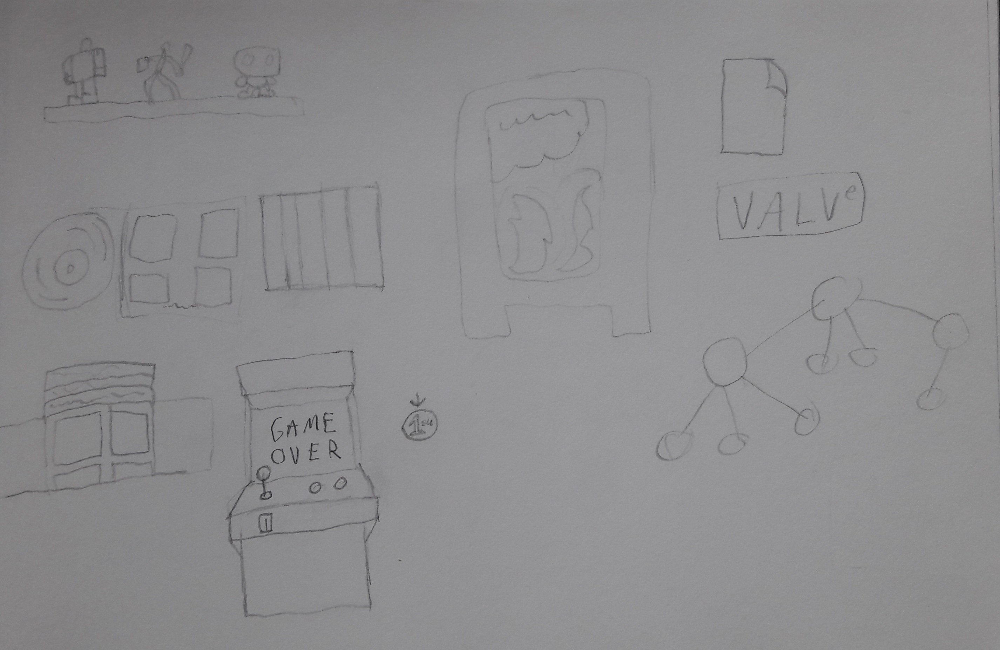
  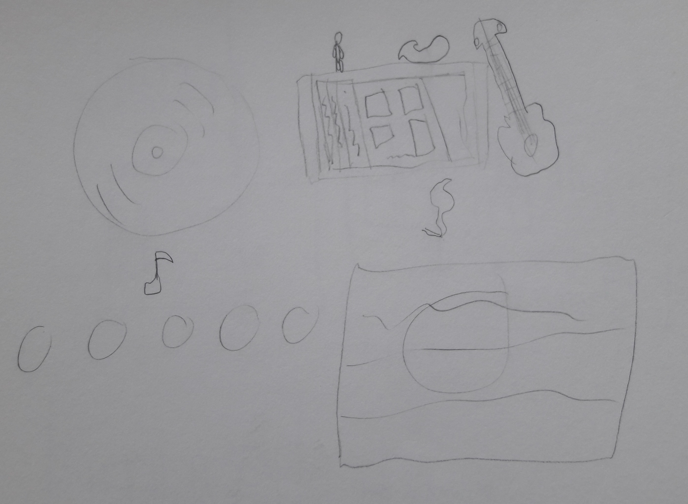

  ### Je ambitie: 
  Aan deze technieken/punten wil ik werken:
  - Een pagina maken die echt voelt als een locatie waar je bent
  - Mooie transities tussen pagina's maken
  - Veel leuke verwijzingen maken naar het verhaal van de Gorillaz
  - Mooie hover effecten voor objecten
  - Voor elk album een unieke sfeer kunnen maken in de pagina
 

## Voortgang/Feedback 1

  
Mijn bevindingen + wijzigingen

  Bij deze feedback sessie kreeg ik feedback van Olivier over mijn concept.

  ### Bevinding 1:
  In het begin wist ik nog niet welk concept ik wou gebruiken voor de opdracht en hoe ik het moest aanpakken.
  Ik had meerdere ideen maar ik kon geen keuze maken met wat ik het beste kon doen.

  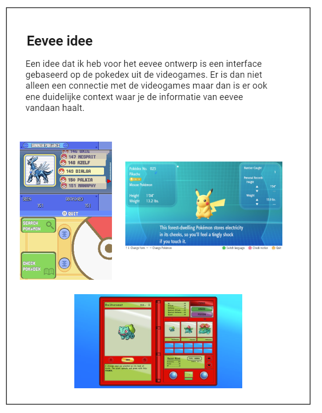  
  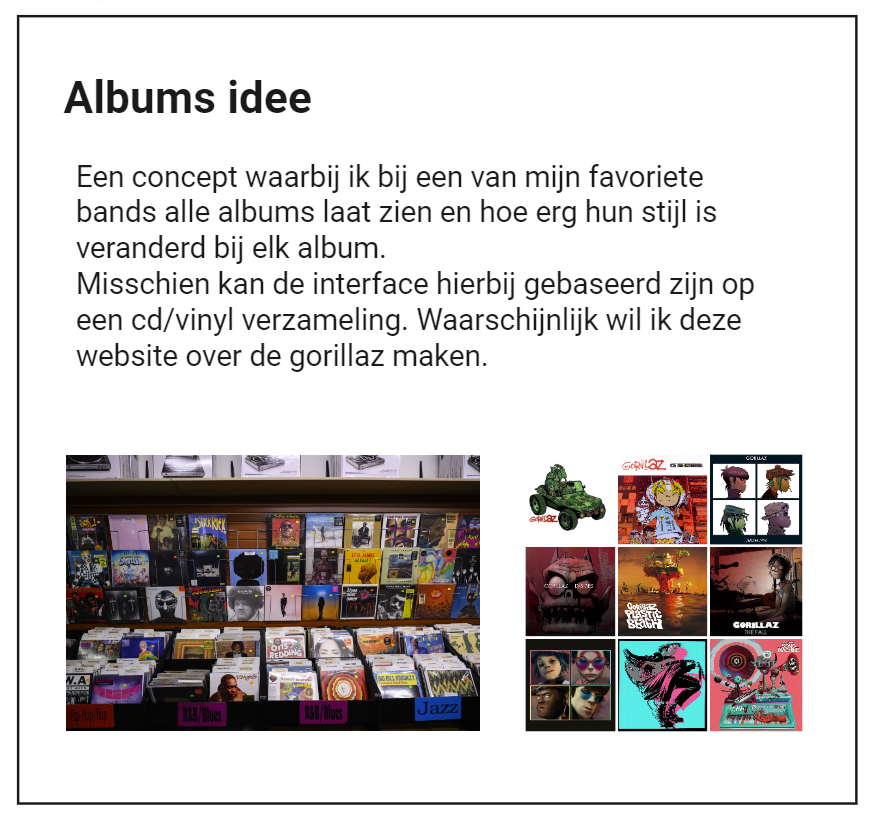
  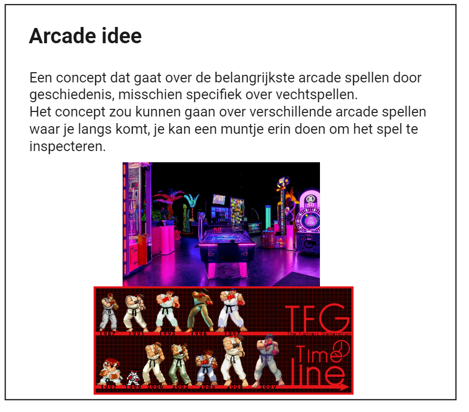
  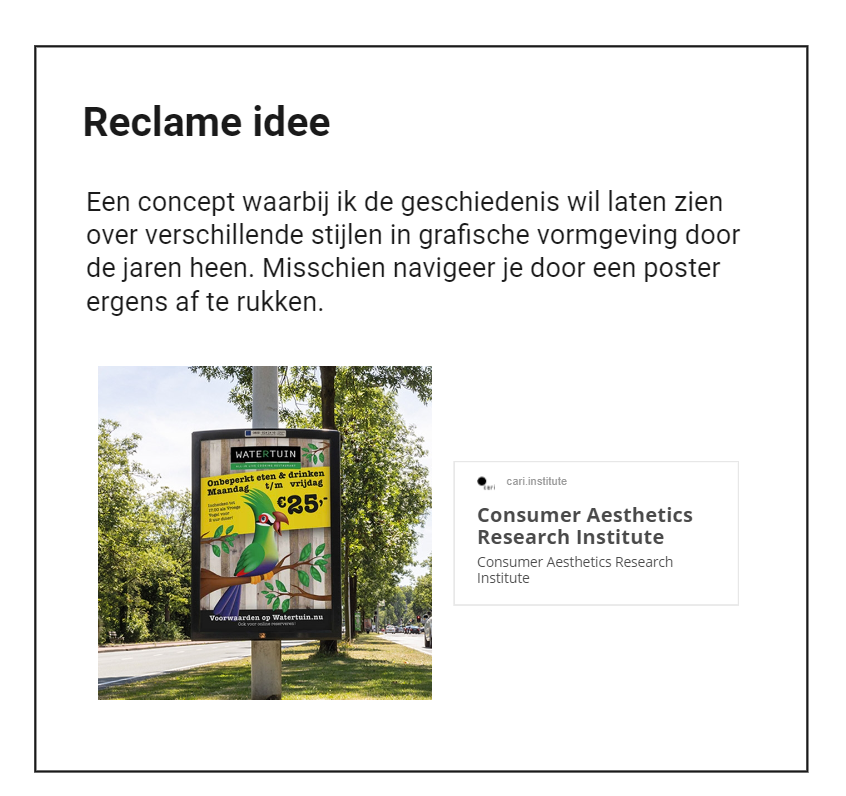
  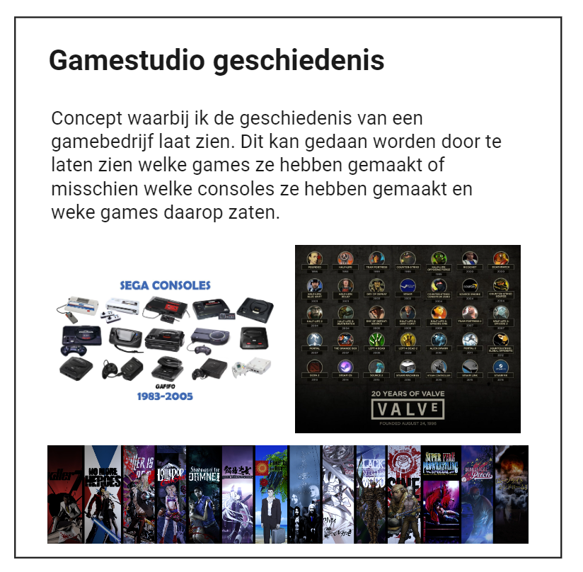

  #### oplossing:
  Met alle concepten die ik heb bedacht bleek uiteindelijk het album concept het beste te zijn. Tot nu toe was dat het concept waar ik het meest ver was gekomen en Olivier dacht zelf ook dat het concept leuk zou kunnen werken.

  ### Bevinding 2:
  Hoe zou ik het beste een unieke interface bedenken die past bij het concept?

  #### oplossing:
  Origineel was ik van plan de albums te presenteren in een vinyl winkel als vinyls. Maar als feedback kreeg ik het idee om de albums als vinyls te presenteren in een vinylkast in iemand zijn kamer. Een vinylwinkel maakt dingen vel te groot en door de vinyle als een verzameling in een kamer neer te zetten geeft het de pagina een meer persoonlijk gevoel.

  ### Bevinding 3:
  Hoe kan ik meer stijl en easter eggs in mijn pagina verwerken?

  #### oplossing:
  Omdat de pagina in een kamer zit zou ik misschien meerder objecten in de pagina zetten die verwijzingen zijn naar het verhaal of de stijl van gorillaz en misschien zouden dit easter eggs kunnen zijn.

  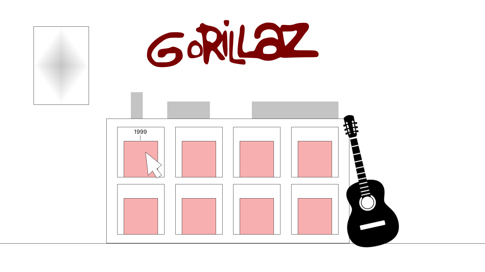

  Eerste ontwerp hoofdmenu

  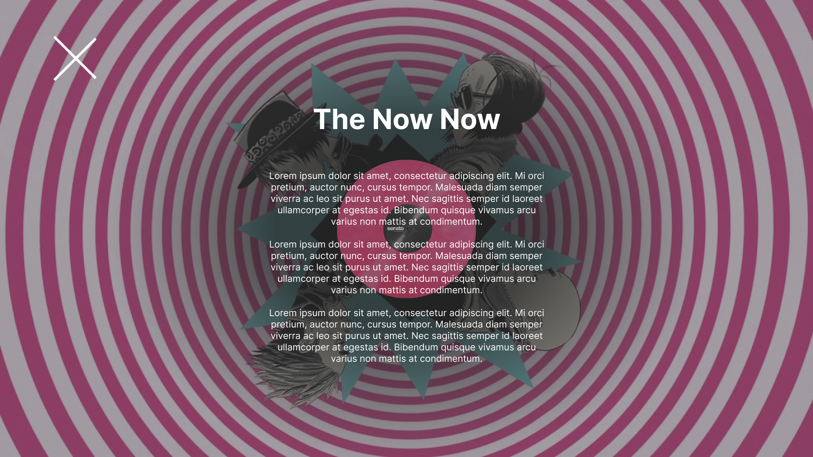

  Eerste ontwerp album

## Voortgang/Feedback 2

  
Mijn bevindingen + wijzigingen

  
  Bij deze feedback kreeg ik vooral feedback over mijn code en of het goed in elkaar zit.

  ### Bevinding 1:
  Voor elke pagina wou ik dat alles langzaam ingeladen werdt, ook dus de video. maar omdat te moeten doen moest ik dat toepassen via javascript en ik wist niet hoe ik dat moest doen

  #### oplossing:
  Ik vroeg aan Sam (een mede-leerling met meer ervaring) of hij dit wist toe te passen. Hij heeft aan mij uitgelegd hoe ik die code moet toepassen op mijn video en hoe ik het makkelijk maak.
  Voor de functie heb ik uiteindelijk deze code gebruikt:

  ''document.body.classList.add("songovergang");
    setTimeout(() => {
        videoS.play()
        }, 5000);''

  ### Bevinding 2:
  De namen die ik gaf aan mijn videos waren zeer verwarrend te begrijpen voor degene die mijn feedback gaf.
  #### oplossing:
  Hiervoor benoemde ikd e videos in mijn javascript ''vidgo'' (vid voor video an go voor gorillaz) en ik hen het veranderd naar videoG, hierdoor is het makkelijker te begrijpen dat het videos zijn en de eerste letter geeft dan aan naar welk album het verwijst.

  ### Bevinding 3:
  Er zaten te weinig custom properties in mijn bestand en ik wist niet welke ik kon gebruiken, ik kreeg toen uitleg van een mede student over hoe ik custom colours kan gebruiken.

  #### oplossing:
  Ik heb in mijn document custom colours gebruikt voor opties die ik vaak gebruik voor mijn kleuren, specifiek maak ik veel gebruik van rgba (0,0,0,0) om elementen een onzichtbare achtergrond te geven.
  Voor de rest kreeg ik nog weinig feedback op mijn code, ik kreeg vooral positief commentar dat het allemaal goed in elkaar zat.

## Voortgang/Feedback 3

  
Mijn bevindingen + wijzigingen 

  
  ### Bevinding 1:
  Mijn laatste feedback heb ik gedaan met Yunus, een student die op een wat hoge nivaeu is met programmeren.
  Op dit moment was ik al heel ver met mijn code dus ik wou vooral vragen of het visueel er goed uit zag. 
  De feedback die ik kreeg van hem was dat de tekst op sommige album pagina's de tekst niet goed te lezen was doordat er geen goede contrast was tussen de achtergrond en tekst.

  #### oplossing:
  Yunus gaf als oplossing dat ik 'text-shadow' kan gebruiken om mijn tekst meer naar voren kan laten komen, dit vond ik een goede suggestie omdat ik op deze manier niet de achtergrond hoef te veranderen terwijl de tekst nog steeds nog duidelijk is te lezen

  ### Bevinding 2:
  Voor de albums heb ik een hover effect toegepast om duidelijk te laten zien uit welk jaar het album komt, maar omdat het selecteerbare tekst is verstoorde de tekst het hover effect. Ik probeer eerst 'user-select:none' toe te passen maar dit gaf geen verandering ik wou er dus achter komen hoe ik ervoor kon zorgen dat de tekst niet selecteerbaar wordt.

  #### oplossing:
  Ik kreeg van een mede-leerling om de functie 'pointer-events: none;' te gebruiken, hierdoor was de tekst niet meer selecteerbaar waardoor het hover effect niet verstoord werdt
 

## Reflectie

  
Mijn eindresultaat & persoonlijke ontwikkeling

  ### Je uitkomst - karakteristiek screenshot(s):

  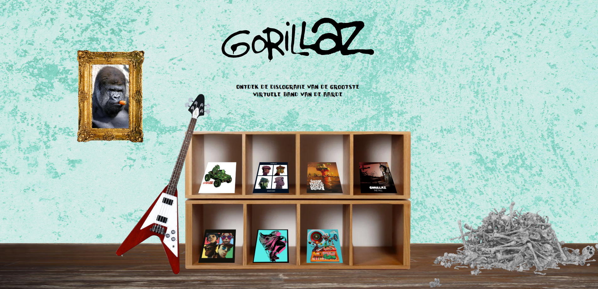
  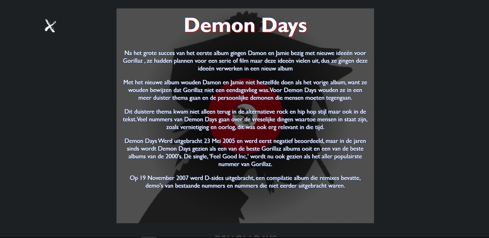

  ### Dit ging goed/Heb ik geleerd: 
  Het belangrijkste dat ik heb geleerd tijdens deze odpracht was animaties maken, door gebruik van animaties heb ik mooie transities kunnen maken binnen mijn pagina die van de website echt een unieke ervaring maakt

  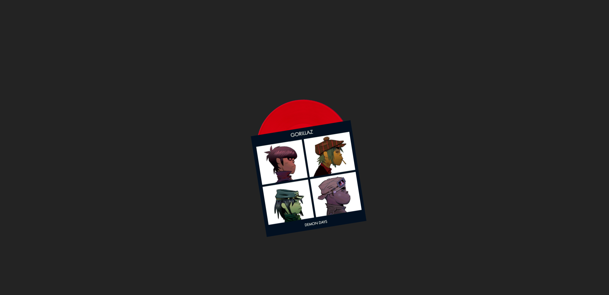

  ### Dit was lastig/Is niet gelukt:
  Korte omschrijving met plaatje(s)
  Origineel was ik van plan veel easter eggs in mijn pagina te doen met allemaal verwijzingen naar het verhaal en de stijl van gorillaz. Maar omdat ik het al erg bezig had met mijn pagina in elkaar te zetten en omdat javascript nog wat lastig is te gebruiken voor mij kwam dit niet uit. Op z'n minst heb ik wel één easter egg in mijn pagina kunnen zetten en heb ik ook de hoofdpagina wat leuk versierd.

  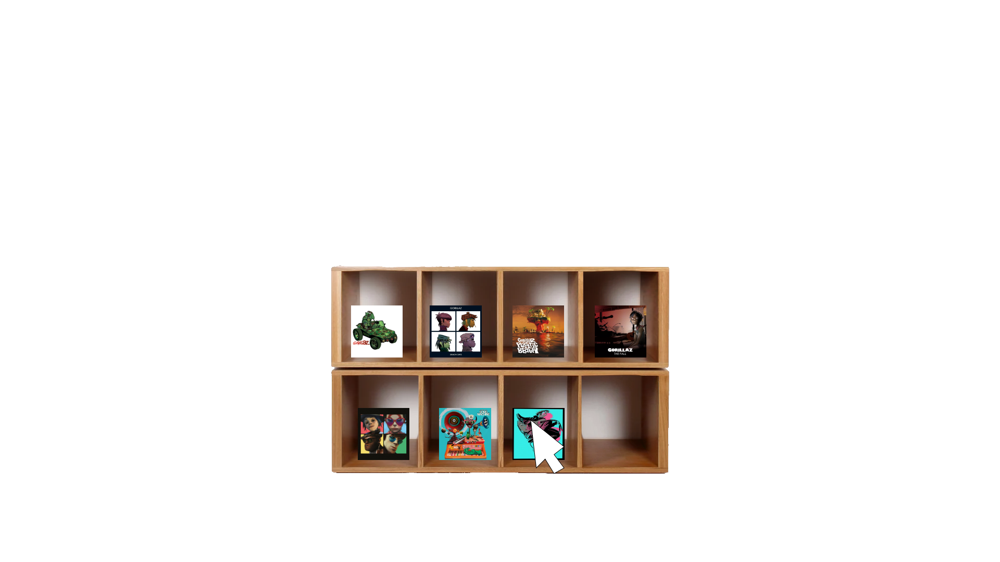

  Alhoewel ik tevreden ben met mijn animaties kon ik niet de transitie maken die ik origineel van plan was, dat het album dat je selecteerd naar voren komt. Ik wist niet hoe ik dit moest regelen en waarschijnlijk als het wel kon moest ik mijn hele manier van werken binen css en javascript veranderen.

  
  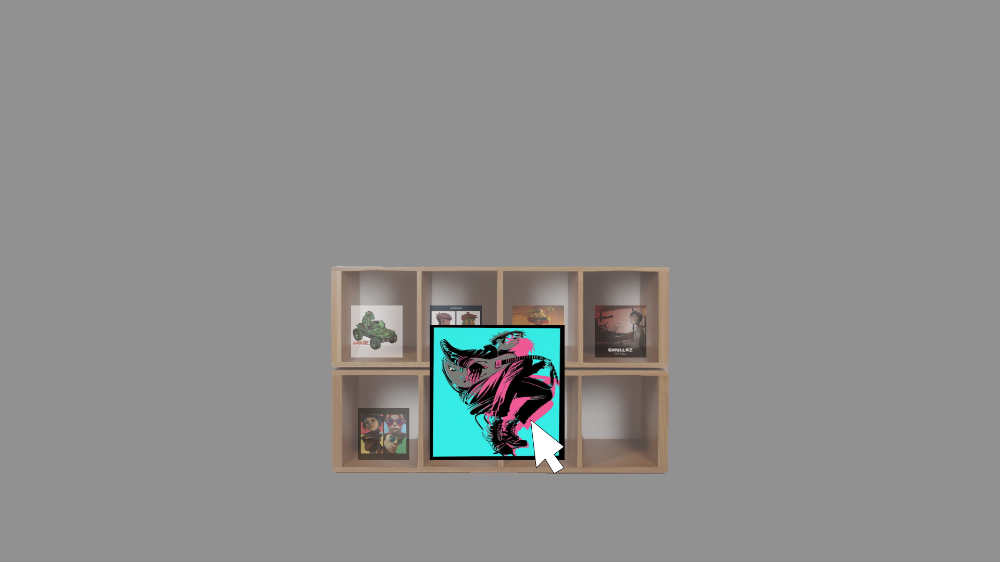
  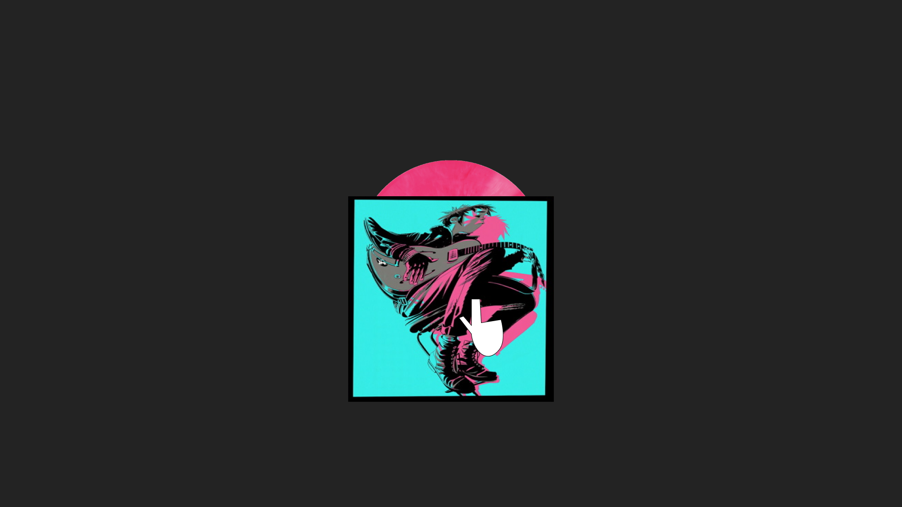

  Ik had ook misschien de albumpagina meer uniek vormgegeven maar omdat ik zelf nog wel moeite heb met css wou ik het liefst het niet te moeilijk te maken voor mijzelf

  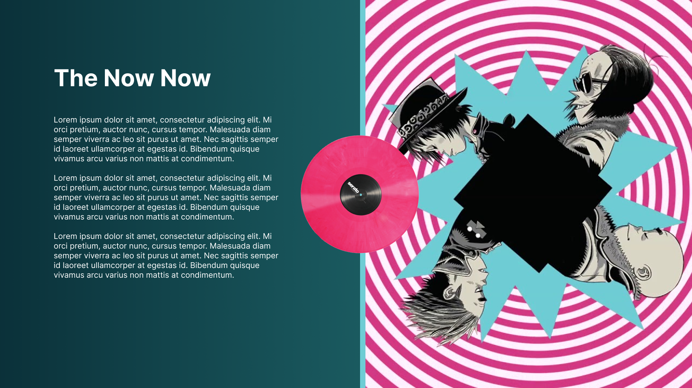

## Bronnenlijst

continu bijhouden terwijl je werkt

Nb. Wees specifiek ('css-tricks' als bron is bijv. niet specifiek genoeg).

1. https://cssgridgarden.com/#nl (grid oefeningen)
2. https://codepen.io/blindingstars/pen/LpzvpX (centreren van tekst)
3. https://www.codespeedy.com/play-selected-part-of-an-audio-file-in-javascript/ (javascript code om een specifiek  deel van de audio te laten afspelen)
4. https://stackoverflow.com/questions/20876864/html5-video-autoplay-but-with-a-5-seconds-of-delay (javascript code om video na een specifiek aantal tijd pas te laten spelen, Sam hielp mij deze code ter versimpelen.)
5. https://css-tricks.com/useful-nth-child-recipies/ (childs selecteren)
6. https://github.com/AaronSmits300/frontendwebsite (oudere opdracht van mij die ik heb gebruikt om javascript interacties te gebruiken)
7. https://www.wikipedia.org/ (afbeeldingen van gorillaz)
8. youtube.com (videos van gorillaz)

